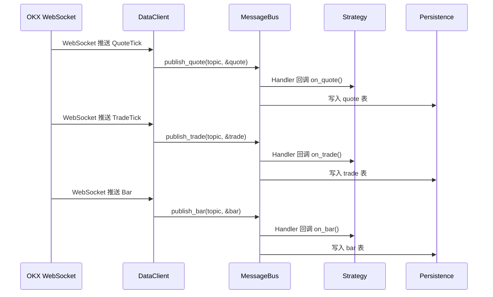
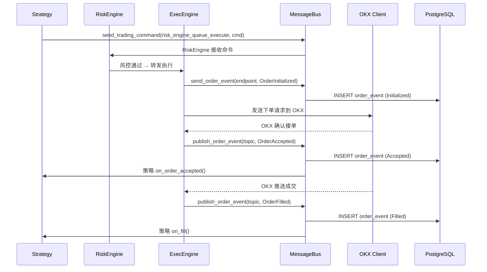
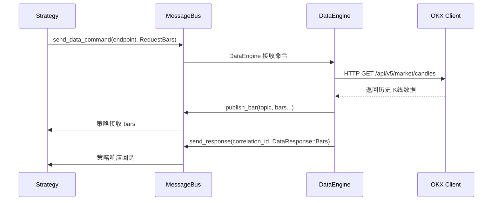

# MessageBus 消息总线（Event Engine）详解

NautilusTrader 的消息总线（MessageBus）是系统内部的事件分发中枢，负责在组件之间进行 **进程内** 通信。

---

## 核心定位

MessageBus 不是消息队列（Kafka/RabbitMQ），而是 **单进程内的高性能事件路由器**。

```
┌─────────────────────────────────────────────────┐
│                  NautilusTrader 进程              │
│                                                   │
│  Adapter ──→ MessageBus ──→ Strategy             │
│  Strategy ──→ MessageBus ──→ Persistence         │
│  Engine  ──→ MessageBus ──→ Cache                │
│                                                   │
│  零网络开销 · 内存分发 · 微秒级延迟                 │
└─────────────────────────────────────────────────┘
```

---

## 架构概览

### 两种路由机制

MessageBus 提供两套独立的消息分发路径，按性能/灵活性取舍：

```
                    类型路由 (Typed)                    动态路由 (Any-based)
                    ──────────────────                  ──────────────────
                    编译期类型安全                       运行期类型分发
                    Handler<T>                          Handler<dyn Any>
                    零 downcast 开销                     每个 handler 都要 downcast
                    适用于高频市场数据                    适用于自定义类型/Python
                    publish_quote()                     publish_any()
                    subscribe_quotes()                  subscribe_any()
```

**性能对比**（AMD Ryzen 9 7950X）：

| 场景 | Typed vs Any |
|------|-------------|
| Handler 分发（空操作） | ~10x 更快 |
| 5 个订阅者 | ~3.5x 更快 |
| 10 个订阅者 | ~2x 更快 |
| 百万条消息 | ~7% 更快 |

### 两种通信模式

```
Pub/Sub（发布/订阅）                      Point-to-Point（点对点）
────────────────────────                   ──────────────────────
一个消息 → 多个订阅者                       一个消息 → 单一端点
支持通配符匹配                              精确地址匹配
subscribe_quotes()                        register_quote_endpoint()
publish_quote()                           send_quote()
主题: data.quotes.BINANCE.BTCUSDT          端点: DataEngine.process
```

---

## 消息类型体系

### 内置类型路由器（Typed Router）

MessageBus 为每种高频数据类型预建了独立的 `TopicRouter<T>`：

```rust
// 核心结构体字段（简化）
pub struct MessageBus {
    // --- Typed Pub/Sub Routers ---
    router_quotes:          TopicRouter<QuoteTick>,      // 报价
    router_trades:          TopicRouter<TradeTick>,      // 成交
    router_bars:            TopicRouter<Bar>,            // K线
    router_deltas:          TopicRouter<OrderBookDeltas>,// 订单簿增量
    router_depth10:         TopicRouter<OrderBookDepth10>,
    router_book_snapshots:  TopicRouter<OrderBook>,      // 订单簿快照
    router_mark_prices:     TopicRouter<MarkPriceUpdate>,// 标记价格
    router_index_prices:    TopicRouter<IndexPriceUpdate>,
    router_funding_rates:   TopicRouter<FundingRateUpdate>,
    router_order_events:    TopicRouter<OrderEventAny>,  // 订单事件
    router_position_events: TopicRouter<PositionEvent>,  // 持仓事件
    router_account_state:   TopicRouter<AccountState>,   // 账户状态
    router_orders:          TopicRouter<OrderAny>,       // 订单
    router_positions:       TopicRouter<Position>,       // 持仓
    router_greeks:          TopicRouter<GreeksData>,     // 希腊字母
    router_option_greeks:   TopicRouter<OptionGreeks>,
    router_option_chain:    TopicRouter<OptionChainSlice>,

    // --- Typed Endpoints (点对点) ---
    endpoints_quotes:          EndpointMap<QuoteTick>,
    endpoints_trades:          EndpointMap<TradeTick>,
    endpoints_bars:            EndpointMap<Bar>,
    endpoints_account_state:   EndpointMap<AccountState>,
    endpoints_trading_commands:IntoEndpointMap<TradingCommand>,
    endpoints_data_commands:   IntoEndpointMap<DataCommand>,
    endpoints_data_responses:  IntoEndpointMap<DataResponse>,
    endpoints_exec_reports:    IntoEndpointMap<ExecutionReport>,
    endpoints_order_events:    IntoEndpointMap<OrderEventAny>,

    // --- Any-based 动态路由 ---
    topics:       IndexMap<MStr<Topic>, Vec<Subscription>>,   // 主题 → 订阅列表
    endpoints:    IndexMap<MStr<Endpoint>, ShareableMessageHandler>, // 端点 → Handler
}
```

### 自定义类型

通过 `router<T>()` 和 `endpoint_map<T>()` 方法可以动态注册任意类型的路由：

```rust
// 自定义类型路由（首次调用时自动创建）
let router = msgbus.router::<MyCustomType>();  // TopicRouter<MyCustomType>
let map = msgbus.endpoint_map::<MyCustomType>(); // EndpointMap<MyCustomType>
```

---

## 主题命名体系

### Switchboard 主题工厂

`MessagingSwitchboard` 集中管理所有内置主题的命名，提供类型安全的主题生成：

```
数据类主题:
  data.quotes.{VENUE}.{SYMBOL}          → data.quotes.BINANCE.BTCUSDT
  data.trades.{VENUE}.{SYMBOL}          → data.trades.OKX.ETHUSDT
  data.bars.{BAR_TYPE}                  → data.bars.ESZ24.XCME-1-MINUTE-LAST-EXTERNAL
  data.book.deltas.{VENUE}.{SYMBOL}     → data.book.deltas.BINANCE.BTCUSDT
  data.book.depth10.{VENUE}.{SYMBOL}    → data.book.depth10.BINANCE.BTCUSDT
  data.book.snapshots.{VENUE}.{SYMBOL}.{INTERVAL} → data.book.snapshots.BINANCE.BTCUSDT.1000
  data.mark_prices.{VENUE}.{SYMBOL}     → data.mark_prices.OKX.BTCUSDT
  data.index_prices.{VENUE}.{SYMBOL}    → data.index_prices.OKX.BTCUSDT
  data.funding_rates.{VENUE}.{SYMBOL}   → data.funding_rates.BINANCE.BTCUSDT
  data.instrument.{VENUE}.{SYMBOL}      → data.instrument.BINANCE.BTCUSDT
  data.instrument.{VENUE}.*             → data.instrument.BINANCE.* (通配符)

事件类主题:
  events.fills.{INSTRUMENT_ID}          → events.fills.BTC-USDT.OKX
  events.cancels.{INSTRUMENT_ID}        → events.cancels.BTC-USDT.OKX
  events.order.{STRATEGY_ID}            → events.order.BUY_AND_HOLD-001
  events.position.{STRATEGY_ID}         → events.position.BUY_AND_HOLD-001
  order.snapshots.{CLIENT_ORDER_ID}     → order.snapshots.O-20240406-001

引擎端点:
  DataEngine.execute                     数据引擎执行
  DataEngine.queue_execute               数据引擎排队执行
  DataEngine.process                     数据处理
  DataEngine.response                    数据响应
  ExecEngine.execute                     执行引擎执行
  ExecEngine.process                     处理执行报告
  ExecEngine.queue_execute               执行引擎排队
  RiskEngine.execute                     风控引擎执行
  RiskEngine.queue_execute               风控引擎排队
  RiskEngine.process                     风控处理
  OrderEmulator.execute                  订单模拟器
  Portfolio.update_account               账户更新

系统:
  commands.system.shutdown               系统关闭命令
```

### 通配符匹配

支持 `*`（匹配任意多个字符）和 `?`（匹配单个字符）：

| 主题 | 模式 | 匹配 |
|------|------|------|
| `data.quotes.BINANCE.BTCUSDT` | `data.quotes.*` | 是 |
| `data.quotes.BINANCE.BTCUSDT` | `data.quotes.BINANCE.*` | 是 |
| `data.quotes.BINANCE.BTCUSDT` | `data.trades.*` | 否 |
| `data.quotes.BINANCE.BTCUSDT` | `data.*.BINANCE.*` | 是 |
| `data.quotes.BINANCE.BTCUSDT` | `data.*.BINANCE.?TCUSDT` | 是 |

---

## Handler 体系

### 两种 Handler 接口

```
Handler<T> (引用式)                        IntoHandler<T> (所有权式)
────────────────                          ──────────────────
handle(&self, message: &T)                handle(&self, message: T)
借用消息，零拷贝                            获取消息所有权
适用于读取/处理                            适用于存储/转发
TypedHandler<T>                           TypedIntoHandler<T>
```

### Handler 创建方式

```rust
// 1. 从闭包（Typed）— 最常用
let handler = TypedHandler::from(|quote: &QuoteTick| {
    println!("Quote: {:?}", quote);
});

// 2. 带自定义 ID 的闭包
let handler = TypedHandler::from_with_id("my-quote-handler", |bar: &Bar| {
    println!("Bar: {:?}", bar);
});

// 3. Any-based 闭包（动态路由）
let handler = ShareableMessageHandler::from_typed(|quote: &QuoteTick| {
    // 走 Any 路由，但内部类型安全
});

// 4. 所有权式 Handler
let handler = TypedIntoHandler::from(|event: OrderEventAny| {
    // 获取事件所有权，可以存储或转发
});

// 5. 实现 Handler trait 的自定义类型
struct MyHandler { id: Ustr }
impl Handler<QuoteTick> for MyHandler {
    fn id(&self) -> Ustr { self.id }
    fn handle(&self, message: &QuoteTick) { ... }
}
```

---

## 完整数据流示例

### 行情数据流



### 订单事件流



### 数据请求/响应流



---

## 线程模型

```
┌─────────────────────────────────────────────────┐
│  thread_local! 存储模型                           │
│                                                   │
│  MESSAGE_BUS: RefCell<Option<Rc<MessageBus>>>    │
│  QUOTE_HANDLERS: RefCell<SmallVec<[...; 64]>>    │
│  TRADE_HANDLERS: RefCell<SmallVec<[...; 64]>>    │
│  BAR_HANDLERS:   RefCell<SmallVec<[...; 64]>>    │
│  ... 每种类型一个 TLS 槽位                        │
│                                                   │
│  每个异步运行时线程有独立的 MessageBus 实例         │
│  无需 Arc/Mutex，避免同步开销                      │
└─────────────────────────────────────────────────┘
```

**关键设计决策：**

- `thread_local!` — 每个线程一个 MessageBus 实例，无锁
- `RefCell` — 运行时借用检查（单线程安全）
- `Rc` — 引用计数共享，非 `Arc`（无跨线程同步）
- `SmallVec<[T; 64]>` — TLS 中的 Handler 缓冲区，前 64 个零分配

---

## 重入安全

Handler 回调中可以安全地再次调用 MessageBus（策略处理订单事件后发取消命令）：

```rust
// 发布流程设计保证重入安全：
// 1. 取出 TLS buffer（std::mem::take）
// 2. 查找匹配 handlers
// 3. 释放 RefCell 借用
// 4. 遍历 handlers 分发
// 5. 清理 buffer 并归还 TLS
//
// 第 3 步释放借用是关键 —— Handler 回调可以自由 borrow_mut()
```

```rust
// 典型场景：策略 on_order_accepted() 中取消订单
let handler = TypedIntoHandler::from(|event: OrderEventAny| {
    // 这里可以安全地再发命令
    send_trading_command(cmd_endpoint, TradingCommand::CancelAllOrders(...));
});
```

---

## 性能优化细节

### 1. 索引缓存

```rust
// TopicRouter 内部缓存
topic_cache: IndexMap<MStr<Topic>, SmallVec<[usize; 64]>>
// 首次 publish 时计算匹配索引，后续直接使用缓存
// subscribe/unsubscribe 时自动清除缓存
```

### 2. 零拷贝分发

```rust
// Typed 路由：&QuoteTick 是 Copy 类型（24 bytes）
// 一次 publish，N 个 handler 都收到同一引用，无 clone
publish_quote(topic, &quote);
// handler 1: &quote
// handler 2: &quote
// handler N: &quote
```

### 3. 缓冲复用

```rust
// TLS 中的 SmallVec<[TypedHandler<T>; 64]> 预分配 64 个槽位
// publish 时 take → fill → dispatch → clear → restore
// 只要 handler ≤ 64 个，永不分配堆内存
```

---

## 与 Kafka 等外部消息队列的区别

| | MessageBus | Kafka |
|---|---|---|
| **范围** | 单进程内 | 跨进程/跨机器 |
| **持久化** | 无（纯内存） | 磁盘持久化 |
| **延迟** | 微秒级 | 毫秒级 |
| **消息丢失** | 进程退出即丢失 | 可重放 |
| **用途** | 组件间实时事件分发 | 跨服务异步消息流 |

**如果做多实例部署需要跨节点消息同步**，可以在外部引入 Kafka/Redis Pub/Sub，但 MessageBus 本身不处理这个场景。

---

## API 速查

### Pub/Sub 订阅/发布

```rust
use nautilus_common::msgbus;

// 类型路由（推荐，高性能）
let handler = TypedHandler::from(|q: &QuoteTick| { ... });
msgbus::subscribe_quotes("data.quotes.*".into(), handler, None);
msgbus::publish_quote(topic, &quote);

// 取消订阅
msgbus::unsubscribe_quotes("data.quotes.*".into(), &handler);

// 动态路由（灵活，适合自定义类型）
let handler = ShareableMessageHandler::from_typed(|q: &QuoteTick| { ... });
msgbus::subscribe_any(pattern, handler, None);
msgbus::publish_any(topic, &message);
```

### 点对点端点

```rust
// 注册端点
let handler = TypedIntoHandler::from(|cmd: TradingCommand| { ... });
msgbus::register_trading_command_endpoint("ExecEngine.execute".into(), handler);

// 发送消息
msgbus::send_trading_command("ExecEngine.execute".into(), command);

// 取消注册
msgbus::deregister_any("ExecEngine.execute".into());
```

### 请求/响应

```rust
// 注册响应处理器（通过 correlation_id 关联）
msgbus::register_response_handler(&correlation_id, handler);

// 发送响应
msgbus::send_response(&correlation_id, &data_response);
```

### 工具函数

```rust
// 检查订阅状态
msgbus::has_endpoint("DataEngine.execute")     // 端点是否存在
msgbus::subscriptions_count_any("data.quotes.*") // 订阅者数量
msgbus::subscriber_count_deltas(topic)           // 类型路由订阅数量

// 主题生成
use nautilus_common::msgbus::switchboard;
let topic = switchboard::get_quotes_topic(instrument_id);
let topic = switchboard::get_trades_topic(instrument_id);
let topic = switchboard::get_bars_topic(bar_type);
```
