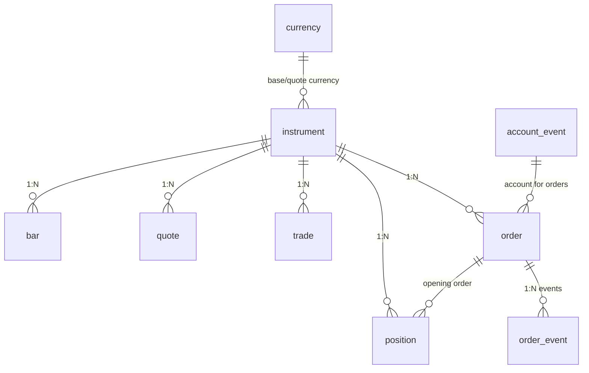
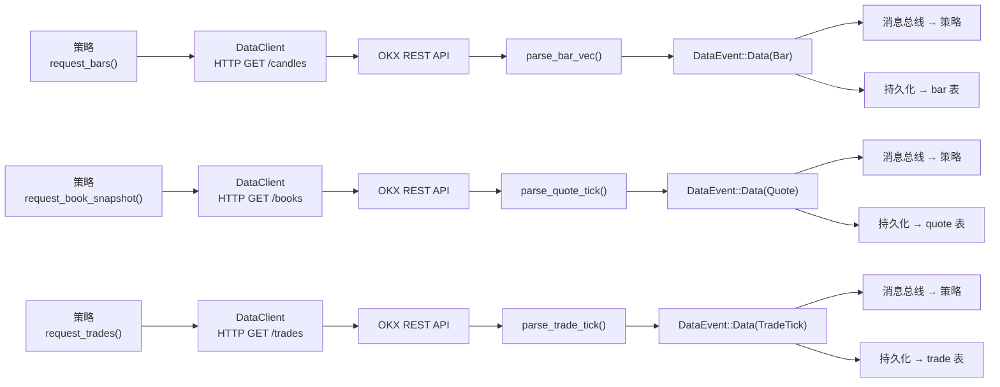
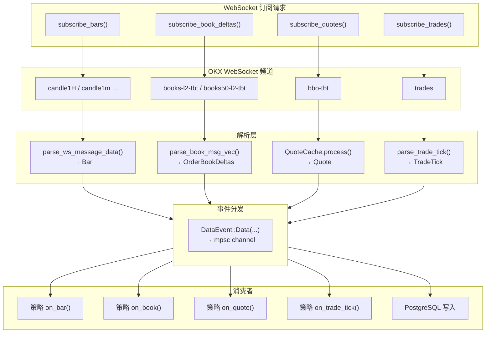
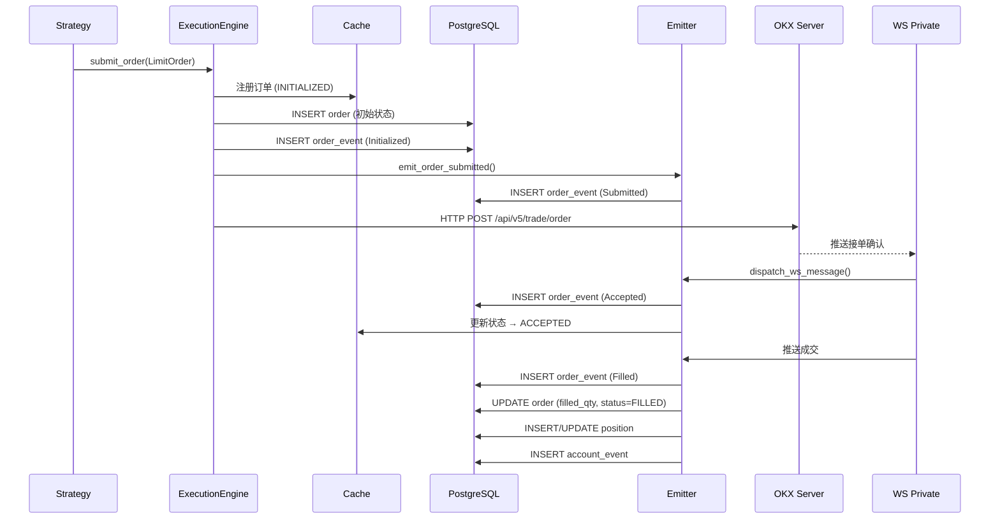
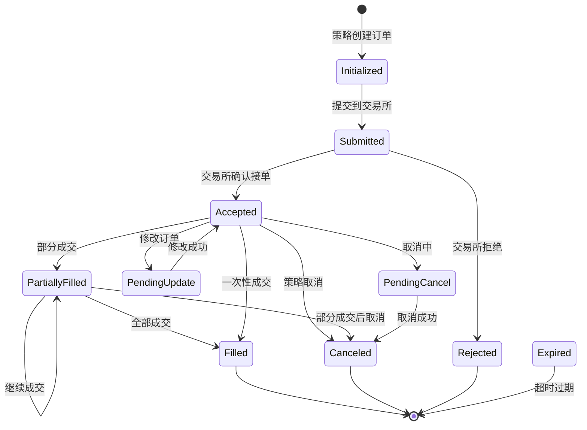
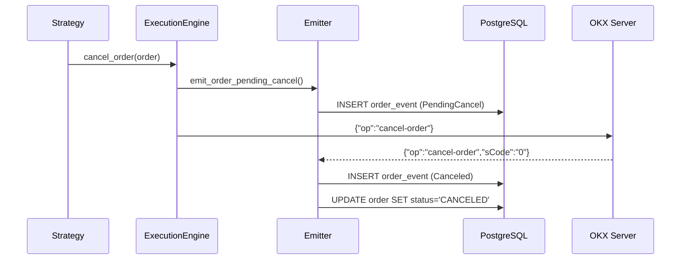
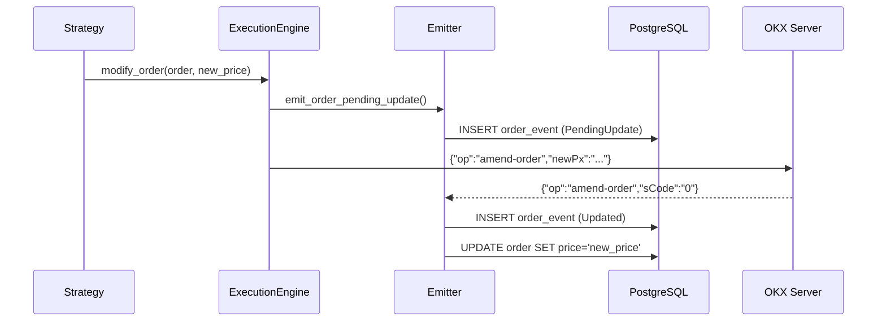
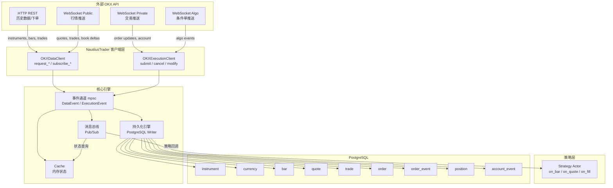

# OKX 适配器数据流向详解

本文以 OKX BTC-USDT 现货交易对为例，完整追踪数据从 OKX API → NautilusTrader 引擎 → PostgreSQL 数据库的全链路。

---

## 数据库表关系图



---

## 阶段一：启动与合约同步

### 1.1 连接与合约发现

**入口**：`OKXDataClient::connect()` → HTTP GET `/api/v5/public/instruments?instType=SPOT`

```
OKX REST API 返回:
[
  {
    "instType": "SPOT",
    "instId": "BTC-USDT",
    "baseCcy": "BTC",
    "quoteCcy": "USDT",
    "stk": "",
    "tickSz": "0.1",
    "lotSz": "0.00000001",
    "minSz": "0.00001",
    "state": "live",
    ...
  }
]
```

### 1.2 合约注册到系统

数据路径：
```
OKX HTTP Response
  → OKXHttpClient::request_instruments()
    → parse_instrument_any()  (解析为 InstrumentAny)
      → DataEvent::Instrument(instrument)  (发送到数据通道)
        → 消息总线分发 → Cache 缓存
        → 持久化引擎 → instrument 表
```

**写入表：`instrument`**

| 字段 | 示例值 |
|------|--------|
| `id` | `"BTC-USDT.OKX"` |
| `kind` | `"Spot"` |
| `raw_symbol` | `"BTC-USDT"` |
| `asset_class` | `"CRYPTOCURRENCY"` |
| `base_currency` | `"BTC"` |
| `quote_currency` | `"USDT"` |
| `price_precision` | `1` |
| `size_precision` | `8` |
| `price_increment` | `"0.1"` |
| `size_increment` | `"0.00000001"` |
| `min_quantity` | `"0.00001"` |
| `margin_init` | `"0"` |
| `margin_maint` | `"0"` |
| `ts_event` | `"1712390400000000000"` |
| `ts_init` | `"1712390400000000000"` |

### 1.3 货币注册

合约中引用的基础货币和报价货币自动注册。

**写入表：`currency`**

| 字段 | BTC 示例 | USDT 示例 |
|------|----------|-----------|
| `id` | `"BTC"` | `"USDT"` |
| `precision` | `8` | `6` |
| `name` | `"Bitcoin"` | `"Tether USD"` |
| `currency_type` | `"CRYPTO"` | `"CRYPTO"` |

---

## 阶段二：历史数据回补

### 2.1 市场数据请求流程



### 2.1 请求历史 K线

**入口**：策略或用户调用 `request_bars()`

```
策略请求 RequestBars {
    instrument_id: "BTC-USDT.OKX",
    bar_type: "1-HOUR-LAST-EXTERNAL",
    start: "2024-04-01T00:00:00Z",
    end: "2024-04-06T00:00:00Z",
    limit: Some(120)
}
  → OKXDataClient::request_bars()
    → HTTP GET /api/v5/market/candles?instId=BTC-USDT&bar=1H&...
      → OKX REST 返回 bars
        → DataResponse::Bars(TradesResponse::new(bars))
          → 消息总线 → 策略接收
          → 持久化引擎 → bar 表
```

**写入表：`bar`**

| 字段 | 示例值 |
|------|--------|
| `instrument_id` | `"BTC-USDT.OKX"` |
| `step` | `1` |
| `bar_aggregation` | `"HOUR"` |
| `price_type` | `"LAST"` |
| `aggregation_source` | `"EXTERNAL"` |
| `open` | `"69500.0"` |
| `high` | `"69800.0"` |
| `low` | `"69200.0"` |
| `close` | `"69650.0"` |
| `volume` | `"1234.5678"` |
| `ts_event` | `"1712390400000000000"` |
| `ts_init` | `"1712390400001000000"` |

### 2.2 请求历史成交

```
request_trades(instrument_id="BTC-USDT.OKX", start=..., end=..., limit=1000)
  → HTTP GET /api/v5/market/trades?instId=BTC-USDT&...
    → 写入 trade 表
```

**写入表：`trade`**

| 字段 | 示例值 |
|------|--------|
| `instrument_id` | `"BTC-USDT.OKX"` |
| `price` | `"69523.4"` |
| `quantity` | `"0.0500"` |
| `aggressor_side` | `"BUYER"` |
| `venue_trade_id` | `"1234567890"` |
| `ts_event` | `"1712390400123000000"` |
| `ts_init` | `"1712390400124000000"` |

### 2.3 请求历史报价

```
request_book_snapshot(instrument_id="BTC-USDT.OKX", depth=Some(20))
  → HTTP GET /api/v5/market/books?instId=BTC-USDT&sz=20
    → 写入 quote 表
```

**写入表：`quote`**

| 字段 | 示例值 |
|------|--------|
| `instrument_id` | `"BTC-USDT.OKX"` |
| `bid_price` | `"69520.0"` |
| `ask_price` | `"69525.0"` |
| `bid_size` | `"2.50000000"` |
| `ask_size` | `"1.80000000"` |
| `ts_event` | `"1712390400000000000"` |
| `ts_init` | `"1712390400001000000"` |

---

## 阶段三：实时 WebSocket 数据流

### 3.1 WebSocket 数据流全景



### 3.2 订阅 K线实时推送

```
subscribe_bars(bar_type="1-HOUR-LAST-EXTERNAL")
  → OKX WebSocket 订阅: {"op":"subscribe","args":[{"channel":"candle1H","instId":"BTC-USDT"}]}
    → OKX 实时推送 bar 数据
      → parse_ws_message_data() → NautilusWsMessage::Data([Bar])
        → DataEvent::Data(Bar)
          → 消息总线 → 策略 on_bar() 回调
          → 持久化 → bar 表
```

### 3.2 订阅订单簿增量

```
subscribe_book_deltas(instrument_id="BTC-USDT.OKX", book_type=L2_MBP, depth=50)
  → 根据 VIP 级别选择频道: books50-l2-tbt / books-l2-tbt / books
    → OKX WebSocket 推送增量数据
      → parse_book_msg_vec() → OrderBookDeltas
        → DataEvent::Data(Deltas)
          → 消息总线 → 策略
          → 持久化层 (如配置)
```

### 3.3 订阅最优买卖盘 (BBO)

```
subscribe_quotes(instrument_id="BTC-USDT.OKX")
  → OKX WebSocket 订阅: bbo-tbt 频道
    → 收到 BBO 数据: {"bids":[["69520","2.5"]],"asks":[["69525","1.8"]],"ts":"1712390400000"}
      → QuoteCache.process()  (合并 bid/ask 为完整报价)
        → DataEvent::Data(Quote)
          → 消息总线 → 策略
          → 持久化 → quote 表
```

### 3.4 订阅实时成交

```
subscribe_trades(instrument_id="BTC-USDT.OKX")
  → OKX WebSocket 订阅: trades 频道
    → 收到成交: {"side":"buy","px":"69523.4","sz":"0.05","ts":"1712390400123"}
      → DataEvent::Data(TradeTick)
        → 消息总线 → 策略 on_trade_tick()
        → 持久化 → trade 表
```

---

## 阶段四：策略触发下单

### 4.1 下单时序图



### 4.2 策略发出下单指令

```python
# 策略代码
order = LimitOrder(
    instrument_id=InstrumentId.from_str("BTC-USDT.OKX"),
    order_side=OrderSide.BUY,
    quantity=Quantity.from_str("0.01"),
    price=Price.from_str("69500.0"),
    time_in_force=TimeInForce.GTC,
)
self.submit_order(order)
```

### 4.2 订单事件流（下单侧）

订单从策略提交到 OKX 执行的完整链路：

```
策略 submit_order(order)
  → TradingNode / ExecutionEngine
    → Cache 注册订单 (状态: INITIALIZED)
      → 写入 order 表 (初始状态)
      → 写入 order_event 表 (kind="Initialized")
        → SubmitOrder 命令 → OKXExecutionClient
          → emitter.emit_order_submitted(order)
            → 写入 order_event 表 (kind="Submitted")
              → OKX WebSocket Private 发送下单:
                {"op":"order","args":[{"instId":"BTC-USDT","tdMode":"cash",
                  "side":"buy","ordType":"limit","sz":"0.01","px":"69500.0",
                  "clOrdId":"O-20240406-001"}]}
```

### 4.4 订单状态机



### 4.5 下单后事件流（OKX 响应侧）

```
OKX Private WebSocket 推送:
{"op":"order","data":[{"ordId":"1234567890","clOrdId":"O-20240406-001",
  "sCode":"0","sMsg":"","tag":""}]}
  → dispatch_ws_message()
    → OrderIdentity 查找 (instrument_id, strategy_id, order_side, order_type)
      → parse_order_event() → ParsedOrderEvent
        → emitter.emit_order_accepted_event(...)
          → OrderAccepted 事件
            → 更新 order 表状态 → "Accepted"
            → 写入 order_event 表 (kind="Accepted")
              → Cache 更新订单状态
```

**写入表：`order`（下单后更新）**

| 字段 | 示例值 |
|------|--------|
| `id` | `"O-20240406-001"` (ClientOrderId) |
| `trader_id` | `"TRADER-001"` |
| `strategy_id` | `"BUY_AND_HOLD-001"` |
| `instrument_id` | `"BTC-USDT.OKX"` |
| `client_order_id` | `"O-20240406-001"` |
| `venue_order_id` | `"1234567890"` |
| `order_type` | `"LIMIT"` |
| `order_side` | `"BUY"` |
| `quantity` | `"0.01"` |
| `price` | `"69500.0"` |
| `time_in_force` | `"GTC"` |
| `filled_qty` | `"0"` |
| `status` | `"ACCEPTED"` |
| `is_post_only` | `false` |
| `is_reduce_only` | `false` |
| `init_id` | `"uuid-init-001"` |
| `ts_init` | `"1712390400000000000"` |
| `ts_last` | `"1712390401000000000"` |

**写入表：`order_event`（完整事件链）**

| 字段 | Initialized | Submitted | Accepted | Filled |
|------|-------------|-----------|----------|--------|
| `id` | `"uuid-init"` | `"uuid-sub"` | `"uuid-acc"` | `"uuid-fill"` |
| `kind` | `"Initialized"` | `"Submitted"` | `"Accepted"` | `"Filled"` |
| `trader_id` | `"TRADER-001"` | `"TRADER-001"` | `"TRADER-001"` | `"TRADER-001"` |
| `strategy_id` | `"BUY_AND_HOLD-001"` | `"BUY_AND_HOLD-001"` | `"BUY_AND_HOLD-001"` | `"BUY_AND_HOLD-001"` |
| `instrument_id` | `"BTC-USDT.OKX"` | `"BTC-USDT.OKX"` | `"BTC-USDT.OKX"` | `"BTC-USDT.OKX"` |
| `client_order_id` | `"O-20240406-001"` | `"O-20240406-001"` | `"O-20240406-001"` | `"O-20240406-001"` |
| `client_id` | `"OKX"` | `"OKX"` | `"OKX"` | `"OKX"` |
| `order_type` | `"LIMIT"` | `"LIMIT"` | `"LIMIT"` | `"LIMIT"` |
| `order_side` | `"BUY"` | `"BUY"` | `"BUY"` | `"BUY"` |
| `quantity` | `"0.01"` | `"0.01"` | `"0.01"` | `"0.01"` |
| `price` | `"69500.0"` | `"69500.0"` | `"69500.0"` | `"69500.0"` |
| `time_in_force` | `"GTC"` | `"GTC"` | `"GTC"` | `"GTC"` |
| `last_qty` | — | — | — | `"0.01"` |
| `last_px` | — | — | — | `"69500.0"` |
| `venue_order_id` | — | `"1234567890"` | `"1234567890"` | `"1234567890"` |
| `commission` | — | — | — | `"0.695"` |
| `ts_event` | `1712390399...` | `1712390400...` | `1712390401...` | `1712390402...` |

### 4.4 订单成交（Fill）

```
OKX WebSocket 推送成交:
{"op":"trade","data":[{"instId":"BTC-USDT","tradeId":"98765","ordId":"1234567890",
  "clOrdId":"O-20240406-001","fillPx":"69500.0","fillSz":"0.01","side":"buy",
  "fee":"0.695","ts":"1712390402000"}]}
  → dispatch_ws_message()
    → parse_order_event() → ParsedOrderEvent(Filled)
      → emitter 触发:
        1. OrderFilled 事件
           → 写入 order_event 表 (kind="Filled")
           → 更新 order 表: filled_qty="0.01", status="FILLED", avg_px=69500.0
        2. 同步更新 position 表
           → 新建或更新持仓记录
```

**写入表：`position`（成交后新建）**

| 字段 | 示例值 |
|------|--------|
| `id` | `"P-BTC-USDT.OKX-BUY-001"` |
| `trader_id` | `"TRADER-001"` |
| `strategy_id` | `"BUY_AND_HOLD-001"` |
| `instrument_id` | `"BTC-USDT.OKX"` |
| `account_id` | `"OKX-001"` |
| `opening_order_id` | `"O-20240406-001"` |
| `entry` | `"LONG"` |
| `side` | `"LONG"` |
| `signed_qty` | `0.01` |
| `quantity` | `"0.01"` |
| `peak_qty` | `"0.01"` |
| `quote_currency` | `"USDT"` |
| `avg_px_open` | `69500.0` |
| `realized_pnl` | `"0"` |
| `unrealized_pnl` | `"25.0"` (市价变动后) |
| `commissions` | `["0.695"]` |
| `ts_opened` | `"1712390402000000000"` |

---

## 阶段五：账户状态同步

### 5.1 连接时账户查询

```
OKXExecutionClient::connect()
  → HTTP GET /api/v5/account/balance
    → OKX 返回账户余额:
      {"totalEq":"10500.0","details":[
        {"ccy":"USDT","eqBal":"9805.0","availBal":"9805.0"},
        {"ccy":"BTC","eqBal":"0.01","availBal":"0.01"}
      ]}
    → emitter.send_account_state(account_state)
      → 写入 account_event 表
```

**写入表：`account_event`**

| 字段 | 示例值 |
|------|--------|
| `id` | `"uuid-acct-001"` |
| `kind` | `"MARGIN"` |
| `account_id` | `"OKX-001"` |
| `balances` | `[{"currency":"USDT","total":"9805.00","free":"9805.00","locked":"0"}, {"currency":"BTC","total":"0.01000000","free":"0.01000000","locked":"0"}]` |
| `margins` | `[]` (现货账户无保证金) |
| `is_reported` | `true` |
| `ts_event` | `"1712390399000000000"` |

### 5.2 实时账户推送

```
OKX Private WebSocket 推送:
{"op":"account","data":[{"totalEq":"10525.0","details":[
  {"ccy":"USDT","eqBal":"9805.00"},
  {"ccy":"BTC","eqBal":"0.01000000"}
]}]}
  → parse_account_message()
    → DataEvent::AccountState
      → 写入 account_event 表 (余额更新)
```

---

## 阶段六：订单取消

### 6.1 取消流程时序



### 6.2 修改流程时序



### 6.3 策略发起取消

```python
self.cancel_order(order)
```

```
策略 cancel_order()
  → ExecutionEngine → CancelOrder 命令
    → OKXExecutionClient::cancel_order()
      → emitter.emit_order_pending_cancel()
        → 写入 order_event 表 (kind="PendingCancel")
          → OKX WebSocket Private 发送取消:
            {"op":"cancel-order","args":[{"instId":"BTC-USDT","ordId":"1234567890"}]}
```

### 6.2 OKX 确认取消

```
OKX WebSocket 推送:
{"op":"cancel-order","data":[{"ordId":"1234567890","sCode":"0","sMsg":""}]}
  → parse_order_event() → OrderCanceled
    → emitter.emit_order_canceled()
      → 写入 order_event 表 (kind="Canceled")
      → 更新 order 表: status="CANCELED"
```

**order_event 表新增记录：**

| 字段 | 示例值 |
|------|--------|
| `kind` | `"PendingCancel"` / `"Canceled"` |
| `client_order_id` | `"O-20240406-001"` |
| `venue_order_id` | `"1234567890"` |
| `ts_event` | `"1712390410000000000"` |

---

## 阶段七：订单修改

```python
self.modify_order(order, price=Price.from_str("69400.0"))
```

```
modify_order()
  → emitter.emit_order_pending_update()
    → 写入 order_event 表 (kind="PendingUpdate")
      → OKX WebSocket Private 发送修改:
        {"op":"amend-order","args":[{"instId":"BTC-USDT","ordId":"1234567890","newPx":"69400.0"}]}
          → OKX 确认修改成功
            → emitter.emit_order_updated()
              → 写入 order_event 表 (kind="Updated")
              → 更新 order 表: price="69400.0"
```

---

## 阶段八：条件单（Algo Order）

OKX 的 Stop、OCO、Trailing Stop 等条件单走单独的 Algo API。

### 8.1 提交条件单

```
submit_order(StopMarketOrder(..., trigger_price="70000.0"))
  → OKXExecutionClient::submit_conditional_order()
    → HTTP POST /api/v5/trade/order-algo
      {"instId":"BTC-USDT","side":"buy","ordType":"conditional",
       "sz":"0.01","slTriggerPx":"70000.0","slTriggerPxType":"last"}
    → OKX 返回 algo_id
      → emitter.emit_order_submitted()
      → emitter.emit_order_accepted()
```

### 8.2 条件触发

```
OKX algo WebSocket 推送（条件触发后）:
{"op":"algo-advance","data":[{"ordId":"algo-123","algoClOrdId":"O-ALGO-001",
  "instId":"BTC-USDT","ordType":"conditional","state":"triggering",
  "actualSz":"0.01","actualSide":"buy"}]}
  → 条件触发，转为普通订单
    → 新订单由 OKX 撮合引擎处理
    → 后续流程同普通订单 (Accepted → Filled)
```

---

## 完整数据流总览

### 系统架构图



### ASCII 精简版（终端友好）

```
┌─────────────────────────────────────────────────────────────────────────┐
│                          外部 OKX API                                   │
├─────────────┬───────────────┬──────────────┬────────────────────────────┤
│ HTTP REST   │ WebSocket     │ WebSocket    │ WebSocket                  │
│ (历史数据)   │ Public (行情) │ Private (交易)│ Algo (条件单)             │
└──────┬──────┴───────┬───────┴──────┬───────┴──────────────┬─────────────┘
       │              │              │                      │
       ▼              ▼              ▼                      ▼
┌─────────────┐ ┌────────────┐ ┌─────────────┐ ┌────────────────────┐
│ OKXDataClient│ │ OKXData    │ │ OKXExecution│ │ OKXExecution      │
│ request_*() │ │ Client     │ │ Client      │ │ Client            │
│             │ │ subscribe_*│ │ submit/     │ │ algo_order        │
│ 返回:        │ │ 推送:      │ │ cancel/     │ │ 推送:             │
│ Instruments │ │ Quote/     │ │ modify      │ │ Order/Fill/Algo   │
│ Bars/Trades │ │ Trade/Bar  │ │ 推送:       │ │ 事件              │
│ Book        │ │ Deltas     │ │ Order事件   │ │                   │
└──────┬──────┘ └──────┬─────┘ └──────┬──────┘ └────────┬───────────┘
       │               │              │                  │
       ▼               ▼              ▼                  ▼
┌─────────────────────────────────────────────────────────────────────┐
│                        数据事件通道 (mpsc)                            │
│              DataEvent / ExecutionEvent                              │
└─────────────────────────────┬───────────────────────────────────────┘
                              │
               ┌──────────────┼──────────────┐
               ▼              ▼              ▼
        ┌────────────┐ ┌───────────┐ ┌─────────────┐
        │ 消息总线    │ │ Cache     │ │ 持久化引擎   │
        │ (Pub/Sub)  │ │ (内存缓存) │ │ (PostgreSQL) │
        └──────┬─────┘ └───────────┘ └──────┬──────┘
               │                            │
               ▼                            ▼
        ┌────────────┐ ┌──────────────────────────────────────────┐
        │ 策略回调    │ │ 数据表映射:                               │
        │ on_bar()   │ │ instrument → instrument                  │
        │ on_quote() │ │ currency   → currency                    │
        │ on_trade() │ │ quote      → quote                       │
        │ on_fill()  │ │ trade      → trade                       │
        │ on_order() │ │ bar        → bar                         │
        │            │ │ order      → order                       │
        │            │ │ order_event→ order_event                 │
        │            │ │ position   → position                    │
        │            │ │ account    → account_event               │
        └────────────┘ └──────────────────────────────────────────┘
```

---

## 事件时序总结

### 完整订单生命周期甘特图

```mermaid
gantt
    title OKX BTC-USDT 订单生命周期 (从创建到成交)
    dateFormat X
    axisFormat %s

    section 启动阶段
    合约同步 (instrument)       :t0, 1712390000, 1s
    账户查询 (account_event)     :t1, 1712390001, 1s
    历史数据回补 (bar/trade)    :t2, 1712390002, 5s

    section 下单阶段
    OrderInitialized            :t3, 1712390400, 100ms
    OrderSubmitted              :t4, 1712390400, 500ms
    OKX 确认 (Accepted)         :t5, 1712390401, 1s

    section 成交阶段
    OrderFilled                 :t6, 1712390402, 100ms
    Position 创建                :t7, 1712390402, 100ms
    Account 余额更新             :t8, 1712390402, 500ms
```



以下是一个完整订单从创建到成交的时间线，以及对应的数据库写入：

| 时间 | 事件 | 触发方 | 写入表 | 订单状态 |
|------|------|--------|--------|----------|
| T0 | 启动，同步合约 | DataClient | `instrument`, `currency` | — |
| T1 | 查询账户余额 | ExecClient | `account_event` | — |
| T2 | 请求历史数据 | DataClient | `bar`, `trade`, `quote` | — |
| T3 | 策略决定下单 | Strategy | — | — |
| T4 | OrderInitialized | Engine | `order`, `order_event` | INITIALIZED |
| T5 | OrderSubmitted | Engine | `order_event` | SUBMITTED |
| T6 | OKX 接单确认 | OKX WS | `order_event` | ACCEPTED |
| T7 | OrderFilled (成交) | OKX WS | `order_event`, `position` | FILLED |
| T8 | 账户余额变更 | OKX WS | `account_event` | — |

每个事件都带有 `ts_event`（事件发生时间，来自交易所）和 `ts_init`（Nautilus 记录时间），确保时间顺序的可追溯性。
